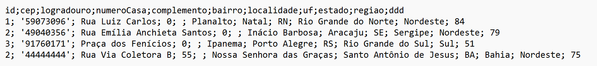
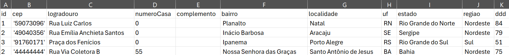
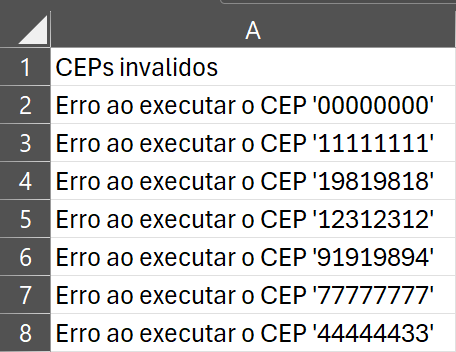
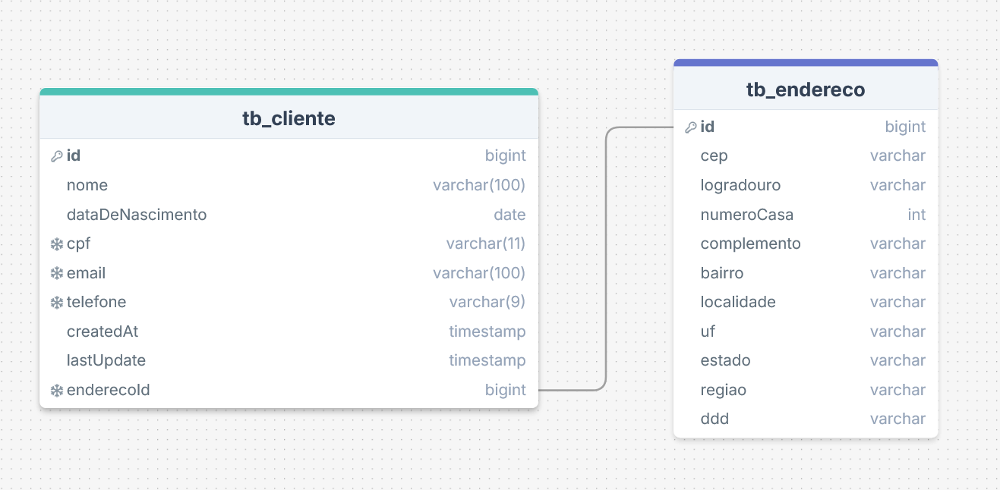
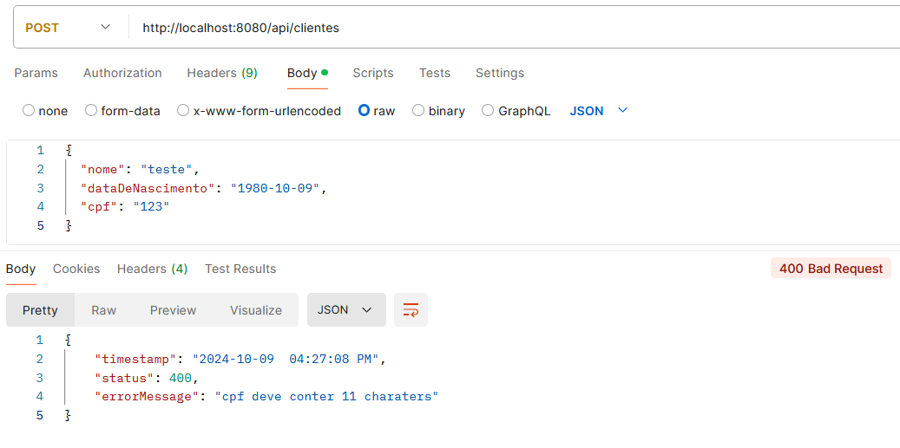
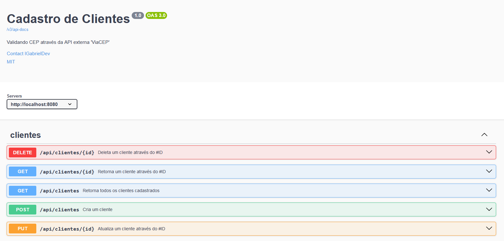
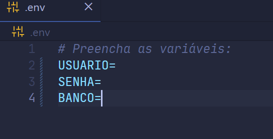

<!-- title -->
<h1 align="center">
    <span>Projeto ViaCEP</span>
     <!-- alterar imagem src-->
</h1>

<br>

<!-- badges -->
<div align="left">
    </img>
    </img>
    </img>
</div>

<br>

<!-- About -->
##  Sobre o Projeto

O projeto consiste em uma API para gerenciar clientes. O endereço completo do cliente é obtido a partir do campo "CEP", onde fazemos uma requisição à [API externa ViaCEP](https://viacep.com.br/) para buscar as informações, como cidade, logradouro, bairro, etc...

Além disso, a cada tentativa de criar ou atualizar um cliente, são gerados dois relatórios em formato .txt:

- **CEPs Válidos**: Lista de todos os CEPs válidos usados.
- **CEPs Inválidos**: Lista de todos os CEPs que foram rejeitados por serem inválidos.

Os relatórios são gerados com os dados separados por ponto e vírgula (`;`), permitindo que sejam facilmente abertos no Excel como se fossem arquivos CSV, com as colunas organizadas corretamente.

<br>

<!-- relatorio imags -->
###  Relatório CEPs válidos


<br>



<br>
<br>

###  Relatório CEPs inválidos


<br>



*Endereços usados somente a fim de exemplo.*

<br>

💡 Esses relatórios ficam armazenados no diretório local: `/var/lib/docker/volumes/_data`

<hr>
<br>

<!-- Functionalities -->
##  Funcionalidades

- [x] Relacionamento entre Entidades
- [x] Create, Read, Update e Delete (CRUD) de clientes
- [x] Validação dos campos inputados
- [x] Lançamento de exceções customizadas
- [x] Leitura e escrita de arquivos, utilizando `BufferedReader` and `BufferedWriter`
- [x] Testes unitários
- [x] Documentação no Swagger

<hr>
<br>

<!-- Technologies -->
##  Tecnologias
- Java 17
- Spring Boot 3.3.4
- Spring Data JPA
- Spring Web
- OpenAPI (Swagger)
- PostgreSQL
- Junit, Mockito and AssertJ
- Docker 27.0.3

<hr>
<br>

<!-- Diagram -->
###  Diagrama de relacionamento

A aplicação trabalha com 2 entidades:

- Cliente
- Endereco

<br>



<hr>
<br>

##  Endpoints


| Método Http | URI | Descrição | Status Code esperado |                  
| :---:       | :--- |  :---    | :---:                |
| DELETE | `http://localhost:8080/api/clientes/{id}` | Deleta um cliente através do #ID      | 200 |
| GET    | `http://localhost:8080/api/clientes`      | Retorna todos os clientes cadastrados | 200 |
| GET    | `http://localhost:8080/api/clientes/{id}` | Retorna um cliente através do #ID     | 200 |
| POST   | `http://localhost:8080/api/clientes`      | Cadastra um cliente                   | 201 |
| PUT    | `http://localhost:8080/api/clientes/{id}` | Atualiza um cliente através do #ID    | 200 |


<hr>
<br>

<!-- Validations -->
##  Validações
Para evitar confusões ao cadastrar ou atualizar um cliente, todos os atributos foram validados.

<br>

### CEP

- Não pode ser NULL.
- Deve ter exatamente 8 caracteres. Nem mais, nem menos.
- Deve conter apenas numbers.
- Deve existir --> É aqui que vamos consultar a API externa viaCEP

<br>
<br>

### Cliente

- **nome**
    - Não pode ser NULL.
    - Deve ter até 100 caracteres.

<br>

- **dataDeNascimento**
    - Não pode ser NULL.
    - Deve ser maior de 18 anos.

<br>

- **cpf**
    - Não pode ser NULL.
    - Deve ter até 11 caracteres.
    - Deve ter apenas números.
    - Deve ser unico.
    - Verificar se o CPF existe *(ainda nao foi implementado)*

<br>

- **email**
    - Não pode ser NULL.
    - Deve possuir `@` e `.com`
    - Deve ter até 100 caracteres.
    - Deve ter apenas números.
    - Deve ser unico.
    - Verificar se o email existe *(ainda nao foi implementado)*

<br>

- **telefone**
    - Não pode ser NULL.
    - Deve ter até 9 caracteres.
    - Deve ter apenas números.
    - O primeiro dígito deve ser o número *9*
    - Deve ser unico.
    - Verificar se o telefone existe *(ainda nao foi implementado)*

<br>

- **numeroCasa**
    - Não pode ser NULL.
    - Deve ser um Integer e NÃO uma String

<hr>
<br>

<!-- Custom Exception Handler -->
##  Lancamento de exceções customizadas

Todas as exceções foram personalizadas para um melhor entendimento do usuário

**Exemplo 1**

	
	
<br>

**Exemplo 2**

	

<hr>
<br>

## Documentação no Swagger

	

<br>

<hr>
<br>

<!-- Build and run -->
##  Rodando a aplicação

### Requisitos
- [git](https://git-scm.com/downloads)
- [Docker](https://docs.docker.com/desktop/wsl/)

<br>

### Passo a passo

1. Clone esse repositório
    ```bash
    git clone hhttps://github.com/lGabrielDev/projeto_viaCEP
    ```
<br>

2. Vá ao diretorio

    ```bash
    cd projeto_viaCEP
    ```

<br>

3. Atribua os valores nas variáveis de ambiente

    

<br>

4.  Suba os containers

    ```bash
    docker compose up -d;
    ```

<br>

5. Acesse o swagger: `http://localhost:8080/swagger.html`

<hr>
<br>

<!-- Credits -->
<h2>
    
    <span>Créditos</span>
</h2>

<p>As imagens usadas nesse projeto foram retiradas dos seguintes sites:</p>

- [shields.io](https://shields.io/)
- [iconfinder](https://www.iconfinder.com/)
- [storyset](https://storyset.com/)
- [vecteezy](https://www.vecteezy.com)

<span>Thanks!</span>

<hr>
<br>


<!-- License -->
##  Licença --> MIT

O projeto está sob a licença do [MIT](../../../../LICENSE.txt).

<hr>
<br>

<!-- Author -->
##  Autor

<br>

<div align="center">
    
    <p> <a href="https://github.com/lGabrielDev">Gabriel Freitas</a> 😎 </p>
</div>